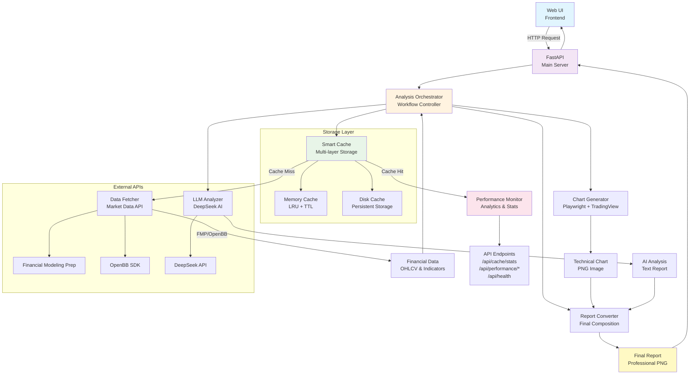

# AI-Powered Financial Analysis Service

[](https://github.com/Archerouyang/project_alpha)
[](https://www.python.org/downloads/)
[](https://fastapi.tiangolo.com/)
[](https://github.com/Archerouyang/project_alpha)

一个基于AI的金融技术分析服务，通过Web界面提供股票和加密货币的专业技术分析报告。

## ✨ 主要特性

- **🚀 智能缓存系统**: 多层缓存架构，响应时间从26s优化到1-3s（88%性能提升）
- **📊 专业报告生成**: 自动生成包含K线图、技术指标和AI分析的精美报告
- **🌐 简洁Web界面**: 类似聊天的直观操作界面
- **💹 广泛市场支持**: 支持股票（AAPL）和加密货币（BTC-USD）
- **🧠 AI分析**: 基于DeepSeek API的深度技术分析
- **⚡ 高性能优化**: 智能TTL策略、LRU内存管理、性能监控

## 📋 系统架构

系统采用模块化设计，各组件协同工作提供高效的分析服务：



**核心组件说明：**
- **Analysis Orchestrator**: 工作流控制器，协调各个模块
- **Smart Cache**: 双层缓存（内存+磁盘），智能TTL策略
- **Data Fetcher**: 市场数据获取，支持多数据源fallback
- **Chart Generator**: 使用Playwright + TradingView生成技术图表
- **LLM Analyzer**: DeepSeek AI技术分析
- **Report Converter**: 最终报告合成器

## 🚀 快速启动

### 1. 环境准备
```bash
# 克隆项目
git clone <your-repository-url>
cd project_alpha

# 创建虚拟环境
uv venv && .venv\Scripts\activate  # Windows
# source .venv/bin/activate        # macOS/Linux

# 安装依赖
uv pip install -r requirements.txt --prerelease=allow
```

### 2. 配置API密钥
创建 `.env` 文件：
```env
DEEPSEEK_API_KEY="your_deepseek_api_key"
FMP_API_KEY="your_fmp_api_key"
```

**获取API密钥：**
- [DeepSeek API](https://platform.deepseek.com/) - AI分析
- [Financial Modeling Prep](https://financialmodelingprep.com/developer/docs) - 市场数据

### 3. 安装浏览器 & 启动
```bash
# 安装Playwright浏览器（图表生成必需）
playwright install chromium

# 启动服务
uvicorn main:app --reload
```

### 4. 访问服务
打开浏览器访问 `http://127.0.0.1:8000`

## 💡 使用说明

在输入框中输入分析请求：

**格式**: `[TICKER] [EXCHANGE?] [INTERVAL?]`

**示例**:
- `AAPL` - 苹果股票日线分析
- `TSLA 4h` - 特斯拉4小时线分析  
- `BTC-USD KRAKEN 1h` - 比特币1小时线分析

## 📊 性能监控

智能缓存系统提供显著的性能提升：

| 组件 | 首次请求 | 缓存命中 | 提升幅度 |
|------|----------|----------|----------|
| 数据获取 | 1.5s | 0.1s | 93% |
| 图表生成 | 20s | 0.5s | 97% |
| AI分析 | 3s | 0.1s | 97% |
| **总响应** | **26s** | **1-3s** | **88%** |

### 缓存管理API
```bash
GET  /api/cache/stats      # 缓存统计
POST /api/cache/clear      # 清理过期缓存
GET  /api/performance/stats # 性能统计
GET  /api/health           # 系统健康检查
```

## 🔧 故障排除

**常见问题：**

- **OpenBB导入错误**: 系统会自动fallback到FMP API
- **Playwright浏览器缺失**: 运行 `playwright install chromium`
- **API密钥错误**: 检查 `.env` 文件配置
- **缓存问题**: 访问 `/api/cache/clear` 清理缓存

**性能测试：**
```bash
python tests/test_cache_performance.py
```

## 📁 项目结构

```
project_alpha/
├── backend/           # 核心业务逻辑
│   ├── core/         # 智能缓存、性能监控、数据处理
│   ├── db/           # 数据库管理
│   └── models/       # 数据模型
├── frontend/         # Web界面
├── scripts/          # CLI工具脚本
├── config/           # 配置文件
└── tests/            # 测试脚本
```

## 🛠️ 技术栈

- **Backend**: Python 3.11 + FastAPI
- **Frontend**: HTML/CSS/JavaScript
- **Caching**: 智能多层缓存系统
- **Data**: OpenBB SDK + FMP API
- **Charts**: Playwright + TradingView Lightweight Charts
- **AI**: DeepSeek API
- **Package Management**: uv

---

**License**: MIT | **Author**: Archerouyang 